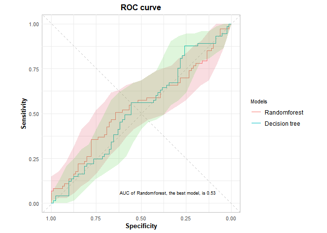
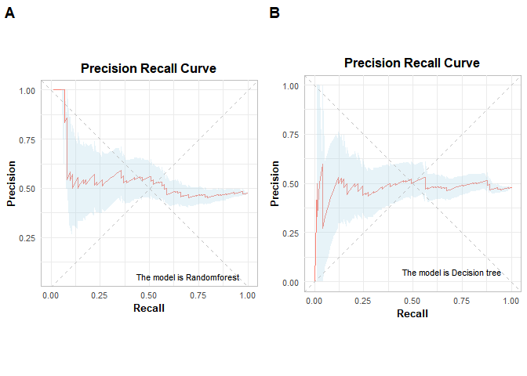

<!-- README.md is generated from README.Rmd. Please edit that file -->

# bjpack1

The goal of bjpack1 is to create a table that includes all of the
important performance measures of classifier to intuitively provide
important information at once that is necessary for the comparison of
the models’ performance, to create a ROC with useful information of the
best model in a neat way, to create a PRC for each model, and to create
a shiny gadget that provides a ROC/PRC according to a user’s choice.

## Installation

You can install the development version of bjpack1 like so:

``` r
install.packages("dplyr")
library(devtools)
install_github("qhwjd246/bjpack1")
library(bjpack1)
```

## Example

This is a basic example which shows you how to solve a common problem:

``` r
library(bjpack1)

## basic example code
## example 1
testy<-sample(c(0,1), 154, replace=TRUE)
pred_test1<-runif (154, min=0, max=1)
pred_test2<- runif (154, min=0, max=1)
predlist<-list(pred_test1, pred_test2)
modellist<-list("Randomforest","Decision tree")


## example 2
testy2<-sample(c(0,1), 1000, replace=TRUE)
pred_test3<-runif (1000, min=0, max=1)
pred_test4<- runif (1000, min=0, max=1)
predlist2<-list(pred_test3, pred_test4)
modellist2<-list("Randomforest","Decision tree")
```

    #> Setting levels: control = 0, case = 1
    #> Setting direction: controls < cases
    #> Setting levels: control = 0, case = 1
    #> Setting direction: controls > cases
    #> Warning in grid.Call.graphics(C_text, as.graphicsAnnot(x$label), x$x, x$y, :
    #> 윈도우즈 폰트데이터베이스에서 찾을 수 없는 폰트페밀리입니다


    #> Setting levels: control = 0, case = 1
    #> Setting direction: controls > cases
    #> Setting levels: control = 0, case = 1
    #> Setting direction: controls < cases


    #> Setting levels: control = 0, case = 1
    #> Setting direction: controls < cases
    #> Setting levels: control = 0, case = 1
    #> Setting direction: controls < cases
    #> Setting levels: control = 0, case = 1
    #> Setting direction: controls > cases
    #> Setting levels: control = 0, case = 1
    #> Setting direction: controls > cases



    #> Setting levels: control = 0, case = 1
    #> Setting direction: controls > cases
    #> Setting levels: control = 0, case = 1
    #> Setting direction: controls > cases
    #> Setting levels: control = 0, case = 1
    #> Setting direction: controls < cases
    #> Setting levels: control = 0, case = 1
    #> Setting direction: controls < cases


    #> Setting levels: control = 0, case = 1
    #> Setting direction: controls < cases
    #> Setting levels: control = 0, case = 1
    #> Setting direction: controls > cases
    #> Setting levels: control = 0, case = 1
    #> Setting direction: controls > cases
    #> Setting levels: control = 0, case = 1
    #> Setting direction: controls < cases
    #> 필요한 패키지를 로딩중입니다: ggplot2
    #> Warning: Removed 1 row containing missing values (`geom_path()`).
    #> Removed 1 row containing missing values (`geom_path()`).



    #> Warning: Removed 1 row containing missing values (`geom_path()`).
    #> Removed 1 row containing missing values (`geom_path()`).


``` r
##shiny gadget
#first example result
newshiny=bjshiny (testy, pred_test1,modellist)
#second example result
newshiny1=bjshiny (testy2, pred_test3,modellist2)
```
